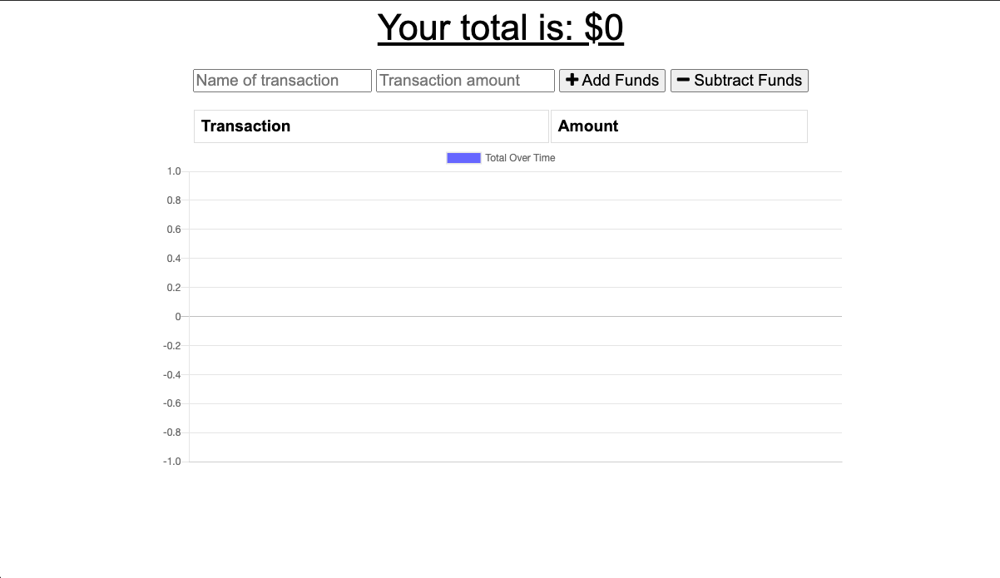
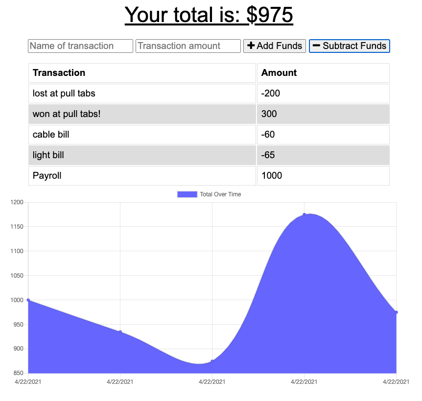

   

# 
 **Budget Tracker** 

--- 

--- 

## **Table Of Contents** 

---

1. [Description](#description)
2. [Installation](#installation)
3. [Usage](#usage)
4. [Contributing](#contributing)
5. [Tests](#tests)
6. [Review and Contribute](#github)
--- 

## 
  **Description** 
 

--- 

The user will be able to add expenses and deposits to their budget with or without a connection.  When entering transactions offline, they should populate the total when brought back online.

--- 
 
## 
  **Installation** 

--- 
 
This app is deployed on heroku.  If you would like to download it locally the link to the repository is listed below.  When the repo is cloned, simply run an npm i to download the necessary dependencies.  To run the app input npm start.  The app should direct you to port 3000 for local development.

--- 

## 
  **Usage** 

--- 

The interface is pretty simple.  the input fields above include the name of your transaction, then the transaction amount.  If adding funds to your virtual checkbook, simply hit the add funds button, the opposite button to decrement the funds available.  To test its availability offline simply throttle it in the dev tools on Google Chrome.

--- 

## 
  **Contributing** 

--- 

License is attatched if you wish to contribute.

--- 

## 
 **Review and contribute here**

### _Github:_ [cmgson/budget-tracker](https://github.com/cmgson/budget-tracker)

### _Email:_ cmgson1@gmail.com

### _Heroku:_ [Budget Tracker](https://pwa-budget-tracker21.herokuapp.com/)

--- 
